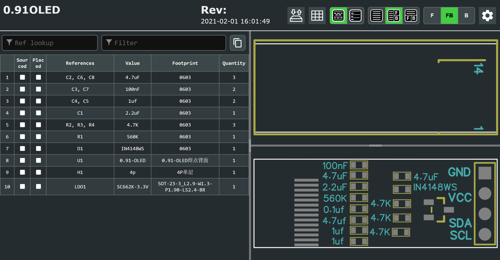

# 328P-MiNi-T12

视频地址：https://www.bilibili.com/video/BV1q54y1p7Bn

项目源码及原理图基于 https://github.com/jie326513988/mini-T12 修改

视频中的屏幕部分也是自己打板焊接的，屏幕的Gerber以及iBOM已上传

外壳一根亚克力管即可，以下是无外壳的图片以及长度对比图

 

## 主控板成品照片

 

## 带有精美iBOM方便对照焊接

 

 

