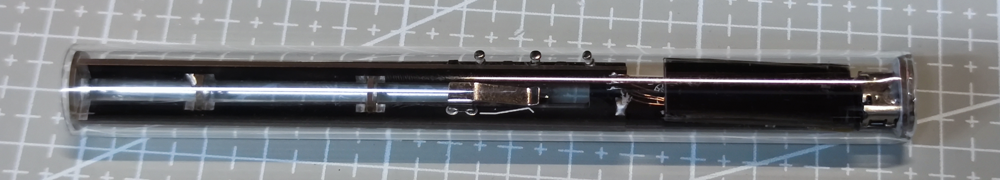
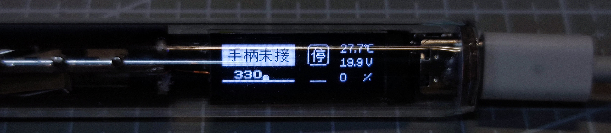
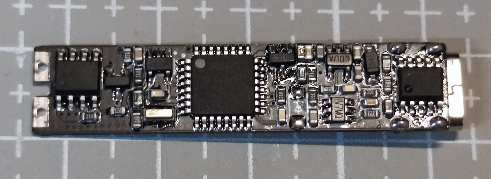
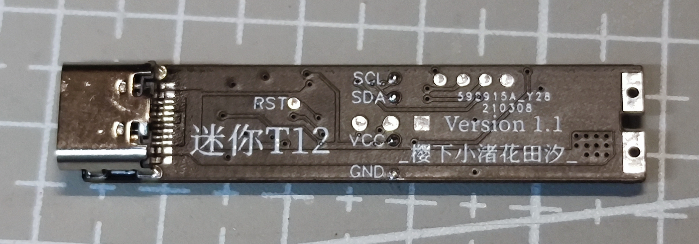

# 328P-MiNi-T12（所有文件打板不过审我不管！）
- 所有文件不定期更新

## 更新历史
- 2021.4.5   上传已修改适配的甘草最新1.20版本程序
- 2021.2.28  上传V1.1版本的iBOM以及原理图
- 2021.3.26  更新触摸版本控制的支架（接线方法及所需元器件后期更新）打板不过审我不管
- 2021.3.23  更新V1.1版本Gerber文件
- 2021.2.27  上传支架Gerber文件
- 2021.2.17  重新上传分开打板的文件并更新README.md
- 2021.2.16  将主控板以及屏幕合并为同一打板文件并更新iBOM文件并更新README.md

## 注意事项
- 屏幕主控在一起的板子没有打板过，不知道能不能过JLC审核（故保留分开打板的Gerber文件）
- 合并的Gerber与分开的Gerber背面的焊点位置及丝印位置有些许差距，完全不影响
- 屏幕和主控板暂时采用飞线连接

***支架板厚&nbsp;1.0mm***

***主控板及屏幕板厚&nbsp;0.8mm***

## 套件及成品开车QQ群：903440195（***不提供解决疑难杂症服务***）

[B站视频地址①](https://www.bilibili.com/video/BV1q54y1p7Bn) &nbsp;&nbsp;&nbsp;&nbsp;&nbsp;&nbsp;&nbsp;&nbsp;&nbsp;&nbsp;&nbsp;&nbsp; [B站视频地址②](https://www.bilibili.com/video/BV1bz4y1m7pS)

项目源码及原理图基于 https://github.com/jie326513988/mini-T12 修改

以下带亚克力管的支架为触摸控制的支架，文件后续更新上来

 

 

       
***
### 主控板成品照片

V1.0版本

 

V1.1版本

     
***
### 带有精美iBOM方便对照焊接

 
